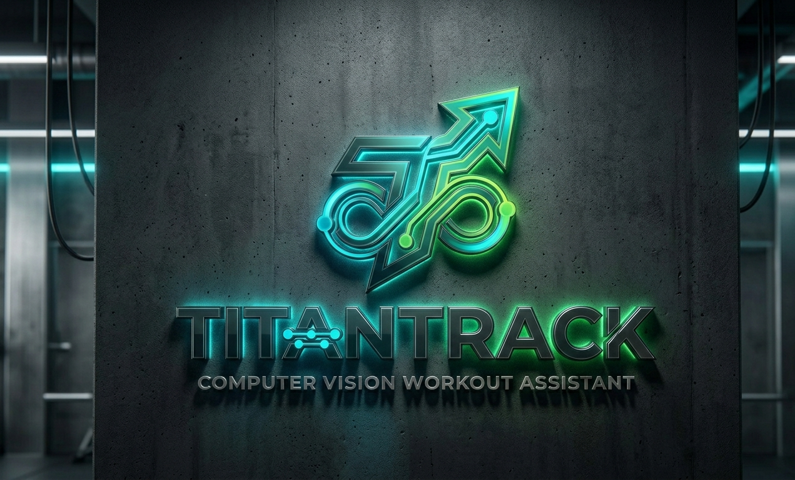

# TitanTrack
TitanTrack is a smart fitness system using Computer Vision and MediaPipe to track 33 body points by webcam. Its ensures correct exercises from using angle-based validation and real-time feedback. Built with Flutter, FastAPI, Python, and MySQL, it delivers accurate AI-powered workout coachig at Home.
# 🏋️‍♂️ TitanTrack AI: Computer Vision Workout Assistant


> **"Turning raw pixels into biomechanical data to ensure every rep is a perfect rep."**

---

## 📝 Project Overview

**TitanTrack AI** is a sophisticated, full-stack fitness ecosystem designed to solve the primary challenge of home-based training: the lack of professional form correction. While traditional workout apps rely on simple timers or mobile accelerometer data, TitanTrack utilizes **Computer Vision** and **Asynchronous Pose Estimation** to transform a standard webcam into a high-precision biomechanical coach. Developed as a bridge between high-performance AI and user-centric web design, the platform provides an elite training experience for athletes and students alike.

At its core, TitanTrack leverages the **Mediapipe Pose Landmarker** engine to track 33 unique skeletal landmarks in real-time. Unlike basic motion trackers that suffer from "ghost counting," TitanTrack employs a custom-built **Dual-Threshold State Machine**. This logic requires users to complete a full, validated range of motion—calculated via trigonometric joint angles—before a repetition is registered. For instance, in "Hard Mode," the system won't count a pushup unless the elbow angle drops below 70° and returns to full extension, while simultaneously verifying that the user's torso remains horizontal. This level of scrutiny ensures that every calorie burned is earned through proper technique.

The architecture is built on a high-performance "Process Bridge" strategy. The **Flutter Web** frontend provides a sleek, glassmorphic dashboard where users can select from eight specialized exercises. Once an exercise is initiated, the **FastAPI** backend triggers a dedicated Python AI process that bypasses browser hardware limitations, offering real-time skeletal overlays and live angular feedback directly on the body. All session data is seamlessly synchronized to a **MySQL** database, where points and calories are calculated based on difficulty-weighted multipliers. By combining the study of kinematics with modern web technologies, **TitanTrack AI** represents a significant leap in accessible sports science.

---

## 🚀 Core Features

* **8 Specialized Exercises**: Pushups, Squats, Chin-ups, Plank, High Knees, Jumping Jacks, Lunges, and Burpees.
* **Anti-Cheat Logic**: Full-body posture checking prevents counting reps if the user is merely "shaking" or standing still.
* **Real-time HUD**: High-tech visual pipeline showing the skeleton, joint angles, and current stage of the rep.
* **Adaptive Difficulty**: Three levels (Easy, Medium, Hard) that dynamically adjust required angular depth.
* **Distributed Architecture**: A mobile/web interface acting as a remote controller for a local AI processing node.

---

## 📐 The Science (Trigonometric Validation)

The system calculates the interior angle of joints using the **Vector Dot Product** formula:

$$\theta = \arccos\left(\frac{\vec{ba} \cdot \vec{bc}}{|\vec{ba}| |\vec{bc}|}\right)$$

For a **Squat** to count on **Hard Mode**, the system requires:
1.  **Hip Y-Coordinate** must increase (Body moves down).
2.  **Knee Angle** must drop below **80°**.
3.  **Knee Angle** must return above **160°**.

---

## 🛠️ Technical Stack

* **Frontend**: Flutter (Web) - Glassmorphism UI
* **Backend**: FastAPI (Python) - Process Bridge
* **AI Engine**: Mediapipe & OpenCV - Pose Estimation
* **Database**: MySQL - Persistent Workout Logs
* **Tunneling**: ngrok - Secure Public-to-Local Bridge

---

## 📂 Project Structure

```text
TitanTrack/
├── TitanTrack/             # Flutter UI & State Management
├── backend_api/              # FastAPI & AI Engine
│   ├── main.py           # Backend server & Launch Bridge
│   ├── ai_engine.py      # Master Computer Vision logic
│   └── requirements.txt  # Python Dependencies
├── assets/               # Branding & Realistic Logos
└── database/             # SQL Schema & Migrations
```
## ⚙️ Installation & Setup
1. Backend Setup
```Bash
cd backend_api
pip install -r requirements.txt
python main.py
```
2. Tunneling (Optional for Public Demo)
```Bash
ngrok http 8000
```
# Copy the https URL into TitanTrack/lib/services/pose_provider.dart
3. Frontend Setup
```Bash
cd TitanTrack
flutter pub get
flutter run -d chrome --web-renderer html
```
## 👨‍💻 Developer
* Biswaprakash Sahoo (Chiku) 
* BCA Student | Rajdhani College
* Specializing in AI-Vision and Full-Stack Systems.

## 🛡️ License
Distributed under the MIT License.
